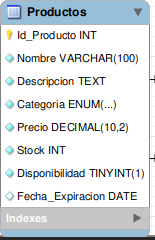
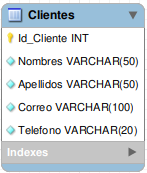
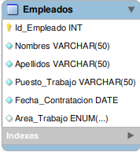
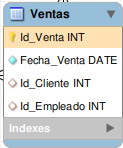
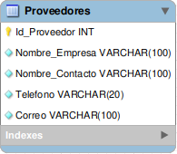
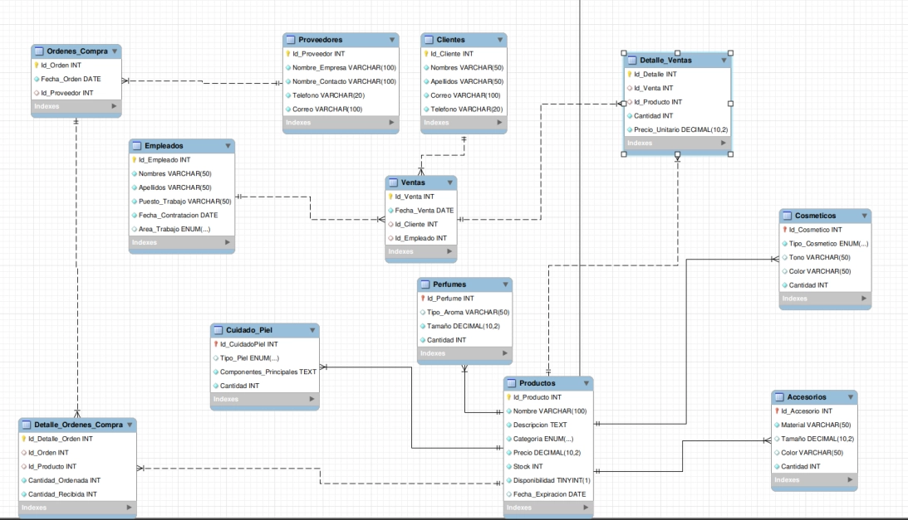

# Base de Datos Sephora 

Se ha normalizado la base de datos de una univerdidad para que sea más eficiente y asi evitarle la redundancia de datos.

## Tabla de contenido 

| Indice | Titulo          |
| ------ | --------------- |
| 1      | Intalacion      |
| 2      | Tecnologias     |
| 3      | Requerimientos  |
| 4      | Entidades Prin  |
| 5      | Diagrama UML    |
| 6      | FAQs            |
| 7      | Licencia        |
| 8      | Grupo           |
| 9      | Consultas       |

## 1 Instalación 

```bash
git clone https://github.com/Stefanyyy15/AdrianUstariz_YuliSanchez_MaquillajeSQL
cd AdrianUstariz_YuliSanchez_MaquillajeSQL
code .
```

## 2 Tecnologias 

Lista de tecnologías utilizadas en el proyecto:

- [MySQL](<[https://developer.mozilla.org/en-US/docs/Web/MYSQL](https://developer.mozilla.org/en-US/docs/Web/MYSQL)>): Utilizado para la gestión de la base de datos relacional.

## 3. Requerimientos del sistema

### Requerimientos:

1. **Productos**:
    - Cada producto tendrá un identificador único, nombre, descripción, categoría (cosméticos, cuidado de la piel, perfumes, accesorios), precio y stock disponible.
    - Los productos de cosméticos incluirán campos adicionales como el tipo (labial, base, sombra, etc.), tono/color, y fecha de expiración.
    - Los productos de cuidado de la piel tendrán información sobre tipo de piel (seca, grasa, mixta), componentes principales y fecha de expiración.
    - Los perfumes y accesorios también tendrán características específicas (tipo de aroma, tamaño, material, etc.).
2. **Clientes**:
    - Cada cliente debe ser registrado con un identificador único, nombre completo, correo electrónico, dirección y número de teléfono.
3. **Ventas**:
    - Cada venta realizada debe ser registrada con un número único, la fecha de la venta, el cliente que realizó la compra, los productos adquiridos y la cantidad de cada uno.
    - Además, se debe registrar el empleado que atendió la venta.
4. **Empleados**:
    - Los empleados tendrán un identificador único, nombre completo, puesto de trabajo, fecha de contratación, y pueden estar asignados a diferentes áreas (venta, bodega, administración).
5. **Proveedores**:
    - Cada proveedor debe tener un identificador único, nombre de la empresa, nombre del contacto, teléfono y dirección.
    - Se debe llevar un registro de las órdenes de compra realizadas a los proveedores, con los productos solicitados, la fecha de la orden, y la cantidad de productos recibidos.

## 4 Entidades Principales

### 4.1 Productos

- **Descripción**: Almacena la información básica de los productos y sus atributos.



### 4.2 Clientes

- **Descripción:** Contiene los detalles de cada cliente, incluyendo sus distintas relaciones.



### 4.3 Empleados

- **Descripción:** Registra información sobre los empleados, permitiendo acumular numeros de ventas.



### 4.4 Ventas

- **Descripción:** Información sobre las ventas realizadas por el establecimiento.




### 4.5 Proveedores

- **Descripción:** Información sobre los proveedores y sus atributos.



## 5. Diagrama UML



## 6 FAQs 

Lista de preguntas frecuentes:

1. ¿Cómo puedo contribuir al proyecto?
   _Puedes contribuir creando un fork del repositorio y enviando un pull request._

2. ¿Este proyecto está abierto a contribuciones?
   | Tipo de contribución | Aceptado | Comentarios |
   |:---------------------|:--------:|------------:|
   | Reporte de errores | Sí | Utiliza la sección de issues en GitHub |
   | Nuevas características| Sí | Envía un pull request con tus propuestas |

## 7 Licencia 

Este proyecto está licenciado bajo la Licencia MIT.

> La Licencia MIT es una licencia de software libre permisiva que es ampliamente utilizada en la comunidad de software

## 8 Grupo

Nuestro Grupo esta conformado por:
- Adrian Daniel Ustariz Ortiz
- Yuli Stefany Sanchez Santos

## 9 Consultas

- 1. Listar todos los productos de cosméticos de un tipo específico (por ejemplo, "labial").
DELIMITER //

CREATE PROCEDURE Listar_Cosmetico(IN NombreCosmetico VARCHAR(50), OUT Total_Cosmetico INT)
BEGIN
DECLARE Contador INT DEFAULT 0;
        Ola: LOOP
SELECT COUNT(*) INTO Contador FROM Cosmeticos c WHERE c.Tipo_Cosmetico = NombreCosmetico;
IF Contador > 0 THEN 
SET Total_Cosmetico = Contador;
LEAVE Ola;
ELSE
SET Total_Cosmetico = 0;
LEAVE Ola;
END IF;
        END LOOP Ola;
END //

DELIMITER ;

SET @Total_Cosmetico = 0;
CALL Listar_Cosmetico("Labial", @Total_Cosmetico);
SELECT @Total_Cosmetico AS TotalCosmetico;

- 2. Obtener todos los productos en una categoría (cosméticos, cuidado de la piel, perfumes, accesorios) cuyo stock sea inferior a un valor dado.
DELIMITER // 
CREATE PROCEDURE TodoProducto(IN TipoCategoria VARCHAR(50),IN Stockk INT)
BEGIN
    SELECT Nombre, Stock FROM Productos p WHERE p.Categoria = TipoCategoria AND Stock < Stockk;
END //
DELIMITER ;

CALL TodoProducto("Cosmeticos", 150);

- 3. Mostrar todas las ventas realizadas por un cliente específico en un rango de fechas.

DELIMITER // 
CREATE PROCEDURE TodoVentas(IN Id_Cliente INT, IN Fecha_Inicio DATE, IN Fecha_Fin DATE)
BEGIN
    SELECT Id_Venta, Fecha_Venta, Id_Cliente 
    FROM Ventas v 
    WHERE v.Id_Cliente = Id_Cliente 
    AND v.Fecha_Venta BETWEEN Fecha_Inicio AND Fecha_Fin;
END //
DELIMITER ;

CALL TodoVentas(8, "2023-06-05", "2023-06-08");

- 4. Calcular el total de ventas realizadas por un empleado en un mes dado.
DELIMITER // 
CREATE PROCEDURE TotalVentasEmpleado(IN Id_Empleado INT, IN Mes DATE, OUT TotalVentas INT)
BEGIN
    SELECT COUNT(*) INTO TotalVentas
    FROM Ventas v 
    WHERE v.Id_Empleado = Id_Empleado 
    AND MONTH(v.Fecha_Venta) = MONTH(Mes) 
    AND YEAR(v.Fecha_Venta) = YEAR(Mes);
END //
DELIMITER ;

SET @TotalVentas = 0;
CALL TotalVentasEmpleado(1, '2023-06-01', @TotalVentas);
SELECT @TotalVentas AS TotalVentas

- 5. Listar los productos más vendidos en un período determinado.

DELIMITER // 
CREATE PROCEDURE MasVendidos(IN Fecha_Inicio DATE, IN Fecha_Fin DATE)
BEGIN
    SELECT Id_Producto, SUM(Cantidad) AS TotalVendidos
    FROM Detalle_Ventas D 
    JOIN Ventas v ON D.Id_Venta = v.Id_Venta
    WHERE v.Fecha_Venta BETWEEN Fecha_Inicio AND Fecha_Fin
    GROUP BY Id_Producto
    ORDER BY TotalVendidos DESC;
END //
DELIMITER ;

CALL MasVendidos('2023-06-05', '2023-06-09')

- 6. Consultar el stock disponible de un producto por su nombre o identificador.

DELIMITER // 
CREATE PROCEDURE ConsultarStock(IN NombreProducto VARCHAR(50), OUT StockDisponible INT)
BEGIN
    SELECT Stock INTO StockDisponible
    FROM Productos
    WHERE Nombre = NombreProducto OR Id_Producto = NombreProducto;
END //
DELIMITER ;

SET @StockDisponible = 0;
CALL ConsultarStock(2, @StockDisponible);
SELECT @StockDisponible AS Stock;

- 7. Mostrar las órdenes de compra realizadas a un proveedor específico en el último año.

DELIMITER // 
CREATE PROCEDURE OrdenesPorProveedor(IN Id_Proveedor INT)
BEGIN
    SELECT o.Id_Orden, o.Fecha_Orden, d.Cantidad_Recibida
    FROM Ordenes_Compra o
    JOIN Detalle_Ordenes_Compra d ON d.Id_Orden = o.Id_Orden
    WHERE o.Id_Proveedor = Id_Proveedor 
    AND o.Fecha_Orden >= "2023-01-01";
END //
DELIMITER ;

CALL OrdenesPorProveedor(1); 

- 8. Listar los empleados que han trabajado más de un año en la tienda.

DELIMITER // 
CREATE PROCEDURE EmpleadosConMasDeUnAno()
BEGIN
    SELECT Id_Empleado, Nombres, Apellidos, Fecha_Contratacion
    FROM Empleados
    WHERE Fecha_Contratacion <= DATE_SUB(CURDATE(), INTERVAL 1 YEAR);
END //
DELIMITER ;

CALL EmpleadosConMasDeUnAno();

- 9. Obtener la cantidad total de productos vendidos en un día específico.

DELIMITER // 
CREATE PROCEDURE TotalVendidosEnDia(IN Fecha_Dia DATE, OUT TotalVendidos INT)
BEGIN
    SELECT SUM(Cantidad) INTO TotalVendidos
    FROM Detalle_Ventas dv
    JOIN Ventas v ON dv.Id_Venta = v.Id_Venta
    WHERE v.Fecha_Venta = Fecha_Dia;
END //
DELIMITER ;

SET @TotalVendidos = 0;
CALL TotalVendidosEnDia('2023-06-05', @TotalVendidos);
SELECT @TotalVendidos AS TotalVendidos;

- 10. Consultar las ventas de un producto específico (por nombre o ID) y cuántas unidades se vendieron.

DELIMITER // 
CREATE PROCEDURE VentasPorProducto(IN ProductoID INT, OUT TotalUnidadesVendidas INT)
BEGIN
    SELECT SUM(dv.Cantidad) INTO TotalUnidadesVendidas
    FROM Detalle_Ventas dv
    JOIN Ventas v ON dv.Id_Venta = v.Id_Venta
    WHERE dv.Id_Producto = ProductoID;
END //
DELIMITER ;

SET @TotalUnidadesVendidas = 0;
CALL VentasPorProducto(1, @TotalUnidadesVendidas);
SELECT @TotalUnidadesVendidas AS TotalUnidadesVendidas;
